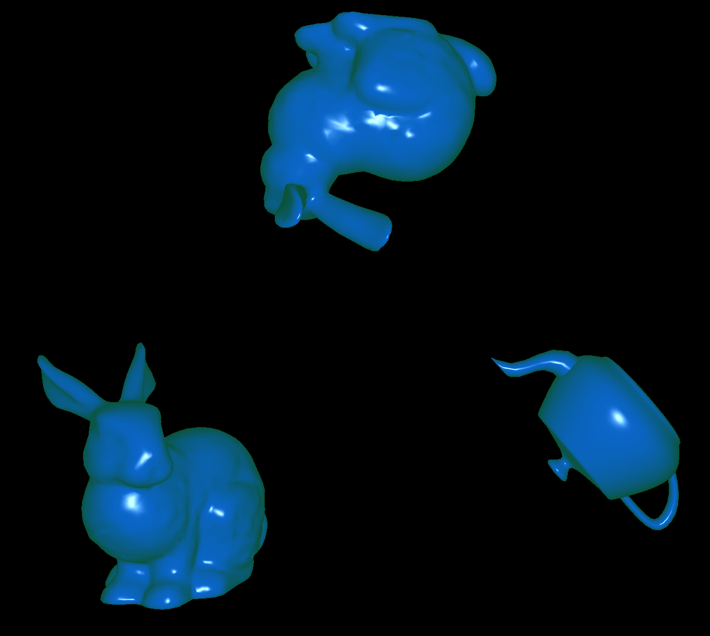
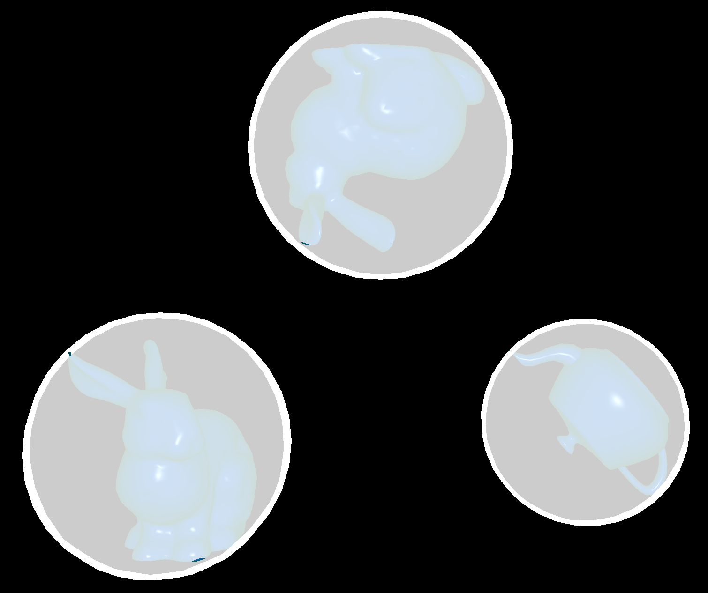
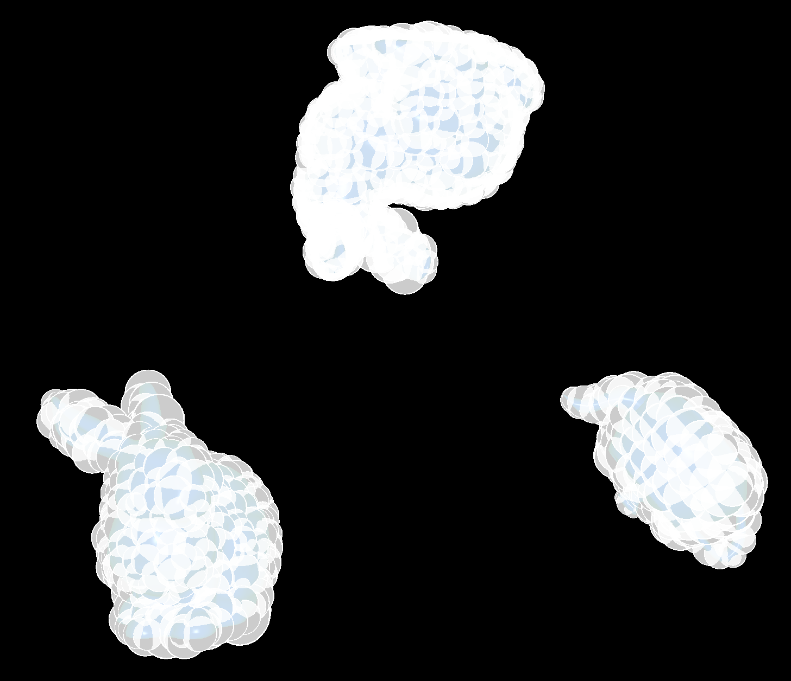
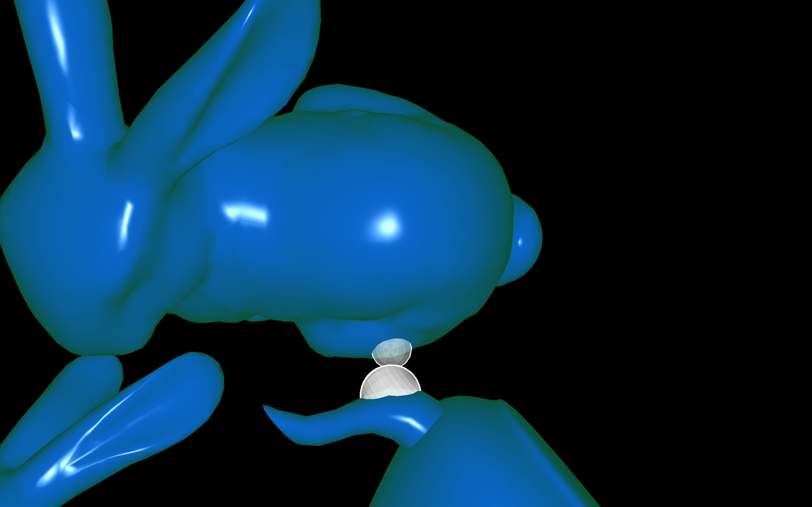

# Hierarchical collision detection with Sphere-Octrees

This was my final project for the class "Introduction to Computer Graphics" at Cal Poly San Luis Obispo in Spring 2016 with Prof. Sueda, who provided a code-basis (thank you!).

The idea is to move two or more 3D object towards each other until they collide. For the collision detection, sphere-octrees will be used. The octree for each object will be created when the program begins and will be used for the collision detection. As soon as two objects collide, they will stop moving and the colliding spheres will be displayed.

# Implementation 
## Sphere-Octree
When creating a sphere-octree node, it receives a bounding box and then creates a bounding sphere which includes all faces that are part of the bounding box. In this program, a face can be part of more bounding boxes when the different vertices are in different bounding boxes. The sphere is defined by an origin and a radius. The origin is with respect to the objects origin, so the translation can be added to the matrix-stack of the object. Also, each octree-node has up to eight child nodes.

For finding a bounding sphere, there are different approaches. This program uses [Miniball](https://people.inf.ethz.ch/gaertner/subdir/software/miniball.html). When creating the child nodes, the nodes bounding box gets split into eight similar bounding boxes. Each of them is used to create one child node.

## Collision detection
After each movement of one or more objects, the collision detection is executed. Therefore, the parent-nodes of each objects are checked for a collision by using their spheres. If two spheres collide, all their child-nodes are checked for collisions. Only if two or more leaf-nodes collide, it is assumed that the objects collide. Since the octrees are created at the program start, and the collision detection itself only must check if the distance between two points is smaller than the sum of their radians, the collision detection only needs 1-3 milliseconds.

## Dynamic environment
The deepness of the octrees is defined in `WorldObject.h`. You can also add more object, even with other shapes. This is done in `main.cpp`. The objects are stored in a vector and are all checked for collision with each other. The start-position, the rotation, and the speed of each object can be configured separately.

# Usage
A cmake file is provided to build it. 

## Requirements
* `EIGEN3_INCLUDE_DIR` is the Eigen include directory and should containt the folder `Eigen`. (tested with Eigen 3.3.4)
* `GLFW_DIR` is the root directory of GLFW. (tested with glfw 3.2.1)
* `GLEW_DIR` is the root directory of glew. (tested with glew 2.1.0)
* Tested with OpenGL 2.1 and clang 8.0.0.

## Programm control
Play and pause with the `space` key. With `s` the spheres can be displayed, and the level for these can be changed with `1-9`, `0` means display the deepest level. Rotate the view with your mouse. With `ctrl` and the mouse you can zoom, with `shift` and the mouse you can move the view.

# More images

